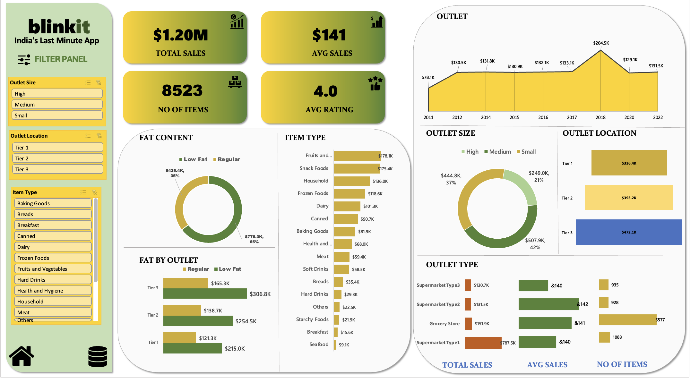

# Blinkit Sales Analytics Dashboard

## 📌 Project Overview
This project analyzes **Blinkit grocery sales data** to understand product performance, outlet trends, and customer purchasing behavior.

The project demonstrates a **complete data analytics workflow** using multiple tools:

- **Excel** for dashboard creation and business visualization
- **Python (Jupyter Notebook)** for data analysis and visualizations
- **SQL** for business query analysis

The goal of this project is to convert raw sales data into **actionable insights that support data-driven decision making**.

---

## 🎯 Objectives
- Analyze grocery sales performance across different outlets
- Identify top-performing product categories
- Understand customer preferences and product ratings
- Explore sales distribution across outlet types and locations
- Visualize key sales trends using an interactive dashboard

---

## 📂 Dataset
The dataset contains Blinkit grocery sales information including:

- Item Identifier  
- Item Type  
- Item Fat Content  
- Item Visibility  
- Item Weight  
- Outlet Identifier  
- Outlet Establishment Year  
- Outlet Size  
- Outlet Location Type  
- Outlet Type  
- Item Rating  
- Sales Value  

The dataset contains more than **8500 records** representing sales across different Blinkit outlets.

---

## 🛠 Tools Used

### Microsoft Excel
Excel was used to perform initial data exploration and create the **interactive sales dashboard**.

Key techniques used:
- Data Cleaning
- Pivot Tables
- Data Aggregation
- Interactive Dashboard Design

---

### Python (Jupyter Notebook - `.ipynb`)
Python was used for **programmatic data analysis and visualization**.

Libraries used:
- Pandas
- Matplotlib
- Seaborn

The Python notebook performs:
- Data exploration
- Sales aggregation
- Category performance analysis
- Visualization of sales trends
- Correlation analysis

The `.ipynb` file demonstrates the **step-by-step analytical workflow and code used to extract insights from the dataset**.

---

### SQL Analysis
SQL queries were written to simulate **database-style business analysis** of the sales data.

The SQL queries answer important business questions such as:

- Which product categories generate the highest sales?
- How do sales vary across outlet locations?
- Which outlet types contribute the most revenue?
- What are the high-demand product segments?

The SQL file demonstrates how sales data would typically be analyzed inside **data warehouses or business intelligence systems**.

---

## 📊 Key Analysis Performed

### Sales Performance Analysis
- Total Sales and Average Sales calculation
- Revenue comparison across outlet types

### Product Analysis
- Top performing product categories
- Item fat content sales distribution

### Outlet Analysis
- Sales comparison by outlet size
- Sales distribution across outlet locations

### Customer Insights
- Customer rating analysis
- Product demand patterns

---

## 📷 Dashboard Preview



---

## 📁 Project Structure

```
Blinkit-sales-Analytics
│
├── Blinkit-sales-Dashboard.xlsx     # Excel dashboard and analysis
├── blinkit_analysis.ipynb           # Python data analysis notebook
├── blinkit_sales_analysis.sql       # SQL business analysis queries
├── Dashboard-preview.png            # Dashboard screenshot
├── README.md
└── LICENSE
```

---

## 📈 Key Insights
- Certain product categories generate significantly higher sales compared to others
- Larger outlets contribute significantly to overall revenue
- Sales patterns vary across outlet location types
- Customer ratings provide insights into product popularity and demand

---

## 🚀 Future Improvements
- Build an advanced **Power BI dashboard**
- Perform **predictive sales analysis using machine learning**
- Integrate the dataset with a **SQL database**
- Apply **demand forecasting techniques**

---

## 📌 Conclusion
This project demonstrates how raw sales data can be transformed into meaningful business insights using **Excel dashboards, Python data analysis, and SQL queries**.

By combining visualization, programmatic analysis, and database-style queries, the project provides a **comprehensive view of Blinkit sales performance and product demand trends**.
